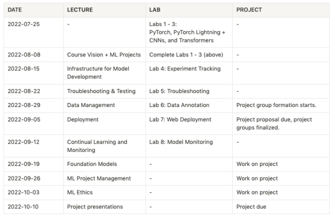

# Full-Stack-Deep-Learning-2022

This is a resource page for Full Stack Deep Learning 2022 course where you will find all the information regarding course schedule, lectures, labs and important URLs

Instructors: Charles Frye, Sergey Karayev, Josh Tobin

## Important links

* [Course GitHub page](https://github.com/full-stack-deep-learning)
* [Course videos YouTube channel](https://www.youtube.com/c/FullStackDeepLearning)
* [Couse Homepage link](https://fullstackdeeplearning.com/course/2022/)
* [Past Course FSDL 2021](https://fullstackdeeplearning.com/spring2021/)

## Course Schedule

